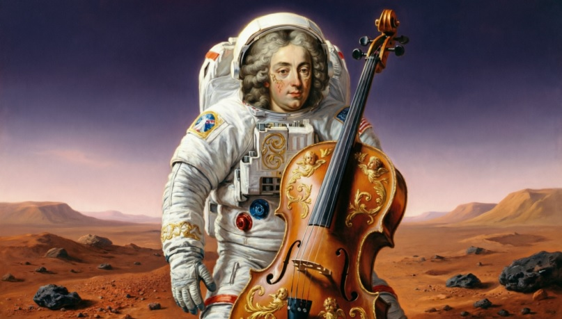
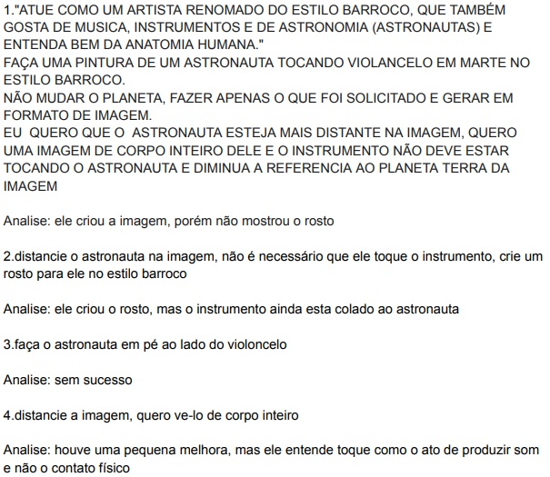

# 🖼️ Engenharia de Prompt: O Astronauta e o Pirata

## 📝 Descrição do Projeto
Este projeto consiste em uma atividade prática de engenharia de instrução (prompt engineering), onde o objetivo principal é dominar a comunicação com modelos de linguagem (LLMs) para obter resultados de alta precisão em um tempo reduzido. Realizado em trios e utilizando dispositivos móveis, o desafio impôs um limite restrito de 5 iterações para gerar dois alvos específicos.

A dinâmica exigiu a execução de um ciclo contínuo de **Avaliação** (análise crítica do que faltou na resposta da IA) e **Integração** (conexão do erro ao novo aprendizado). Os alvos definidos foram: a geração de uma imagem no estilo barroco de um astronauta tocando violoncelo em Marte, e a redação de um e-mail formal de desculpas enviado de um pirata para um rei inglês.

*Figura 1: Imagem gerada pela IA após as iterações de refinamento do prompt.*

## 🚀 Tecnologias Utilizadas
* **Modelo de Linguagem:** Qwen.ai
* **Plataforma:** Acesso via navegador mobile (Celular)
* **Engenharia:** Ciclo iterativo de Avaliar e Integrar (Máx. 5 prompts)

## 📊 Resultados e Aprendizados
O projeto demonstrou como pequenas alterações no vocabulário e na estruturação do contexto alteram drasticamente a percepção e a saída da IA.

* **Desafio de Geração de Imagem:** Houve dificuldade técnica do modelo em separar fisicamente o personagem do seu instrumento. Apesar das solicitações para que o astronauta ficasse de pé ao lado do violoncelo e sem tocá-lo , observou-se que a IA interpreta a instrução de "tocar" como o ato de produzir som, e não necessariamente como o contato físico, limitando a eficácia dos comandos de distanciamento.
* **Desafio de Geração de Texto:** O modelo demonstrou alta capacidade de adaptação semântica, alterando o linguajar para incluir gírias típicas da época solicitada. Além de construir a carta em tom de súplica e arrependimento profundo , a IA enriqueceu o contexto inserindo personagens históricos reais de forma autônoma, assumindo a persona do Capitão William Kidd escrevendo para o Rei Guilherme III.
* **Construção de Narrativa:** O modelo conseguiu equilibrar perfeitamente a formalidade exigida com a oferta de devolução do botim (dobrões e peças de oito) como prova de arrependimento, sem perder o tom de um corsário.

*Figura 2: Análise dos prompts e evolução do texto gerado.*

## 🔧 Como Executar
1. Acesse o modelo em `https://qwen.ai/`.
2. Defina o objetivo inicial (Ex: "ATUE COMO UM ARTISTA RENOMADO DO ESTILO BARROCO...").
3. Analise o primeiro resultado gerado e identifique as falhas (Ex: falta do rosto ou posicionamento incorreto).
4. Aplique a técnica de integração enviando um novo prompt corrigindo os desvios (Ex: "distancie o astronauta na imagem... crie um rosto para ele").
5. Repita o ciclo respeitando o limite máximo de 5 iterações.

---
[Voltar ao início](https://github.com/marcelofg7/Portifolio_Marcelo_Fagundes))
