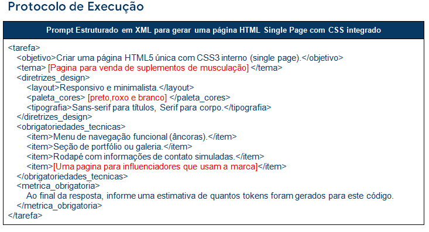
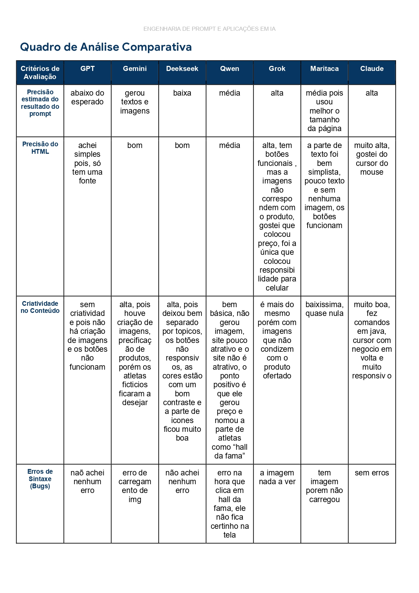
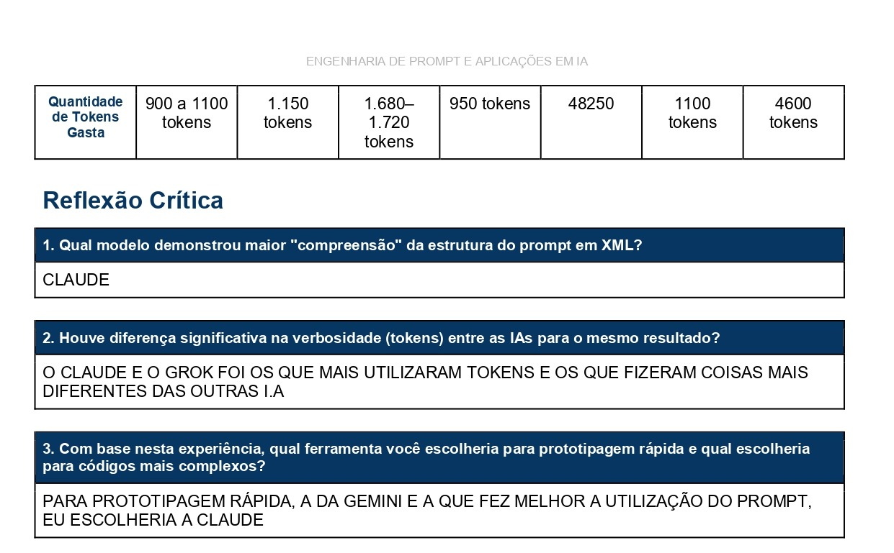

# ⚔️ Batalha de Modelos e Engenharia de Prompt (XML)

## 📝 Descrição do Projeto
Este projeto consiste em um desafio técnico de engenharia de instrução com o objetivo de avaliar a precisão técnica e a conformidade de diferentes Modelos de Linguagem (LLMs) em relação a um conjunto estrito de instruções. O exercício foca na análise crítica de como cada arquitetura de IA processa diretrizes de design e obrigatoriedades técnicas para o desenvolvimento Front-end.

A tarefa central foi a criação de uma página HTML5 única (single page) com CSS3 integrado a partir de um prompt estruturado em XML. O projeto foi parametrizado com os seguintes critérios técnicos:
* **Tema Principal:** Página para venda de suplementos de musculação.
* **Paleta de Cores:** preto, roxo e branco.
* **Layout:** Responsivo e minimalista.
* **Tipografia:** Sans-serif para títulos, Serif para corpo.
* **Funcionalidades:** Menu de navegação funcional, seção de portfólio, rodapé de contato e uma página dedicada a influenciadores que usam a marca.

* Para o teste, foi estruturado um prompt utilizando a sintaxe XML (`<tarefa>`, `<diretrizes_design>`, `<obrigatoriedades_tecnicas>`) com a diretriz de gerar uma página HTML5 *Single Page* com CSS3 interno. O mesmo prompt foi submetido a sete ferramentas diferentes (ChatGPT, Gemini, Claude, Qwen, DeepSeek, Grok e Maritaca) visando avaliar a fidelidade à estrutura solicitada, a criatividade na implementação e o consumo de tokens.

* 
*Figura 1: Exemplo da estrutura de marcação XML utilizada para parametrizar a IA.*

## 🚀 Tecnologias Utilizadas
* **Linguagem de Estruturação:** XML (para definição do prompt estruturado).
* **Saída Técnica:** HTML5 e CSS3 interno.
* **Modelos de Linguagem Testados:** ChatGPT, Gemini, Claude, Qwen, DeepSeek, Grok e Maritaca.

## 📊 Resultados e Aprendizados
A análise comparativa entre as ferramentas revelou diferenças significativas na compreensão da estrutura, na criatividade e no consumo de tokens:

* **Liderança em Compreensão e Complexidade:** O modelo **Claude** demonstrou a maior compreensão da estrutura do prompt em XML. A precisão do HTML foi muito alta, incluindo comandos em Java e um cursor interativo e muito responsivo. Por esse motivo, foi o modelo escolhido para a geração de códigos mais complexos.
* **Prototipagem Rápida:** O modelo **Gemini** foi o escolhido como o ideal para prototipagem rápida, fazendo uma melhor utilização do prompt. Ele gerou textos, imagens e precificação de produtos de forma criativa, embora tenha apresentado erros no carregamento de imagens e os atletas fictícios tenham deixado a desejar.
* **Verbosidade e Uso de Tokens:** Houve grande disparidade no consumo de processamento. O Claude e o Grok foram os modelos que mais utilizaram tokens e entregaram resultados mais diferenciados. O Grok consumiu 48.250 tokens, entregando responsividade para celular e botões funcionais com precificação, mas com imagens que não condiziam com o produto. O Claude utilizou 4.600 tokens. Em contraste, o ChatGPT utilizou entre 900 e 1.100 tokens, mas apresentou um resultado abaixo do esperado, sem criatividade e com botões não funcionais.
* **Outras Observações:** * O modelo **DeepSeek** entregou um layout bem separado por tópicos e com bom contraste de cores, mas os botões falharam na responsividade. 
  * O **Qwen** gerou um site básico e pouco atrativo, apresentando um erro de sintaxe ao clicar na seção "hall da fama".
  * O modelo **Maritaca** entregou o resultado com a criatividade mais baixa (quase nula), sem imagens e com pouco texto, embora os botões estivessem funcionais.
 
   
   
  * *Figura 2: Tabela de avaliação de performance e fidelidade estrutural dos modelos testados.*

## 🔧 Como Executar
1. Copie o arquivo de prompt estruturado em XML desenvolvido neste repositório.
2. Submeta o conteúdo a um dos modelos de IA testados (recomenda-se Claude ou Gemini).
3. Salve o código resultante em um arquivo com a extensão `.html`.
4. Abra o arquivo em um navegador de internet para visualizar a interface da loja de suplementos.

---
[Voltar ao início](https://github.com/marcelofg7/portfolio-marcelo-fagundes-de-oliveira-vieira)
