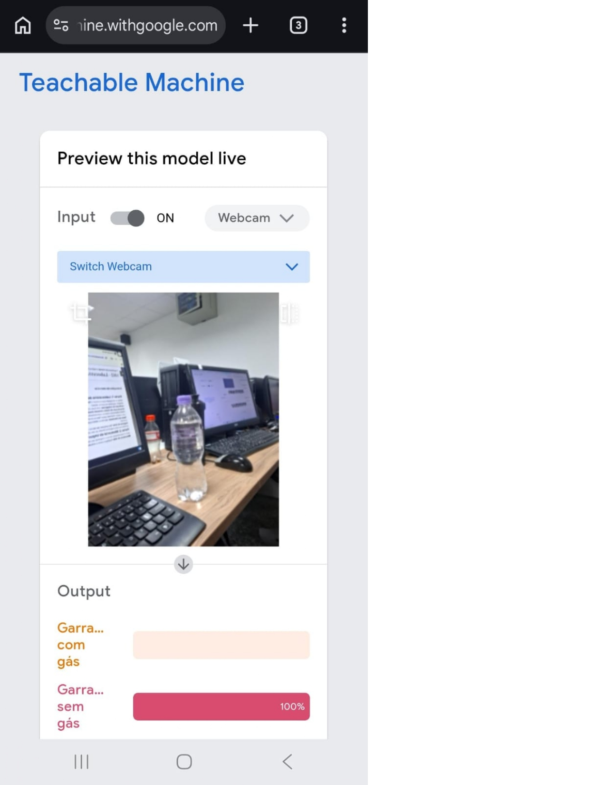
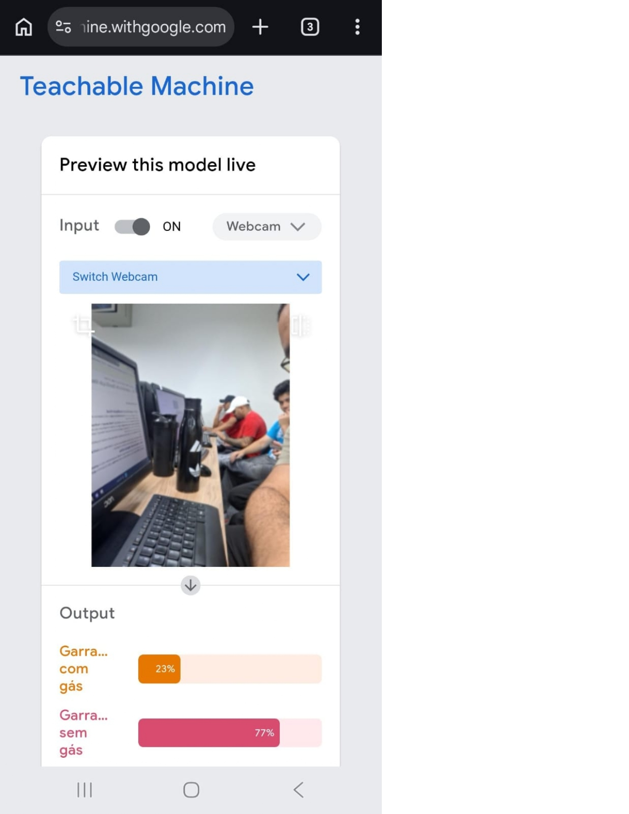
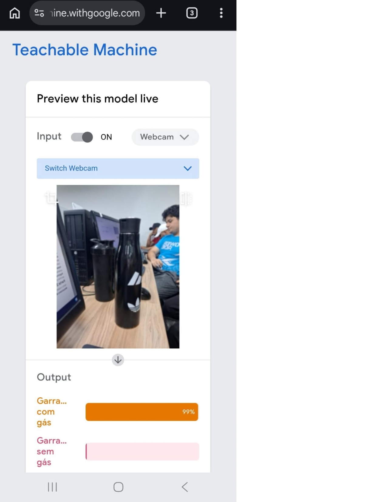

# 👁️ Laboratório de Classificação Visual e Ética em IA

## 📝 Descrição do Projeto
Este projeto consiste em um laboratório prático para explorar o treinamento de modelos de visão computacional e analisar criticamente as consequências do viés algorítmico (bias). Utilizando a plataforma Teachable Machine, o objetivo é treinar um modelo simples de classificação de imagens e forçar falhas de inferência a partir de um dataset intencionalmente limitado.

Embora a proposta teórica envolva a análise de perfis humanos, o experimento técnico demonstrou o viés utilizando objetos físicos (classificação entre "Garrafa com gás" e "Garrafa sem gás"). O teste comprovou que características de captura, como a distância e o posicionamento, corrompem a leitura da IA. Essa falha técnica serviu como base para a elaboração do Memorial de Impacto e Ética, que reflete sobre como erros semelhantes afetam vidas humanas quando aplicados a contextos sociais.

*Figura 1: Exemplo do modelo em funcionamento, demonstrando a leitura da classificação das garrafas.*

## 🚀 Tecnologias Utilizadas
* **Plataforma:** Teachable Machine (Google)
* **Hardware:** Webcam/Câmera de celular para captura de imagens
* **Metodologia:** Treinamento supervisionado de classes visuais (Dataset Enviesado)

## 📊 Resultados e Aprendizados (Memorial de Impacto e Ética)
O experimento prático revelou falhas de classificação (falsos positivos/negativos) causadas pela variação no ambiente e distância, o que fundamenta as seguintes análises éticas:

* **Mecanismo do Viés:** A seleção restrita de dados corrompe a lógica do algoritmo e gera uma visão distorcida da realidade. Informações enviesadas corrompem a sociedade, pois uma mesma imagem capturada de uma distância diferente gera impactos totalmente diferentes na leitura da IA. O ideal exige sempre uma maior quantidade e diversidade de informações.
* **Consequência Social:** O sistema impacta negativamente e marginaliza determinados grupos. Esse viés influencia resultados sensíveis, como uma eleição, e aprofunda a invisibilidade de indivíduos por meio da propagação de classificações falsas e injustas.
* **Ação Mitigadora:** A equipe propõe uma revisão obrigatória no final do projeto. O sistema passa pela curadoria de um comitê técnico multidisciplinar ("Human-in-the-loop"), que avalia e garante a equidade dos dados de treinamento antes da implementação final do modelo.

*Figura 2: Variação de distância gerando incerteza (23% com gás / 77% sem gás) na leitura da IA.*

## 🔧 Como Executar
1. Acesse o [Teachable Machine](https://teachablemachine.withgoogle.com/).
2. Crie um novo projeto de imagem e defina as duas classes de classificação.
3. Alimente o modelo capturando imagens com a webcam (aplicando o viés espacial intencionalmente em uma das classes).
4. Clique em "Train Model".
5. Na seção "Preview", teste a inferência mudando a distância ou o contexto do objeto/pessoa para observar a falha (falso positivo/negativo).

*Figura 3: Falha na classificação evidenciando o viés do modelo.*

---
[Voltar ao início](https://github.com/marcelofg7/portfolio-marcelo-fagundes-de-oliveira-vieira)
