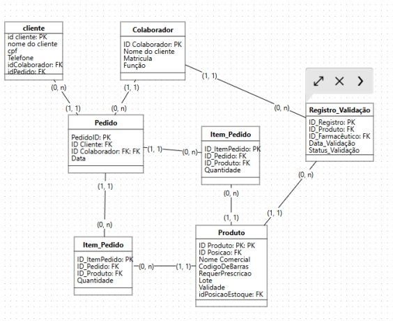

# 🗄️ Artefato 04: Diagrama Entidade-Relacionamento (DER) - Farmácia

## 📝 Descrição do Minimundo
Nosso sistema foi pensado para ajudar no dia a dia das farmácias, focando no processo de separação e conferência de pedidos de delivery. O sistema notifica novos pedidos, mostra a localização exata de cada produto no estoque, permite a validação via código de barras e encaminha automaticamente medicamentos controlados (como tarja preta) para a aprovação de um farmacêutico.

* **O que fazemos:** Agilizar a montagem, mapear o estoque e auditar remédios controlados.
* **O que não fazemos:** O sistema não gerencia o controle financeiro, não altera métodos de pagamento, não roteiriza entregas e não realiza o inventário geral da loja.

## 👥 Equipe do Projeto
* **Integrantes:** Marcelo Fagundes, Gabriel Tino, João Paulo, Henry William, Ítalo Santos, Rodrigo Lemos.
* **Data da Versão:** 25/09/2025.

## 🖼️ Diagrama Entidade-Relacionamento (DER)
O diagrama abaixo representa a tradução lógica das nossas regras de negócio, destacando as Chaves Primárias (PK) e Estrangeiras (FK).

*Figura 1: DER do sistema de farmácia evidenciando as relações entre Pedido, Produto e Registro de Validação.*

## 📌 Detalhamento dos Elementos e Atributos

### Entidades
* **Pedido (PK: ID_Pedido)**
  * Atributos: ID_Pedido (PK), Data, Status (Pendente, Concluído, Em andamento), ID_Cliente (FK), ID_Colaborador (FK).
* **Cliente (PK: ID_Cliente)**
  * Atributos: ID_Cliente (PK), Nome do cliente, CPF, Telefone, Endereço, Email, Conta (indicador de fidelidade).
* **Produto (PK: ID_Produto)**
  * Atributos: ID_Produto (PK), Nome Comercial, CodigoDeBarras, RequerPrescricao (Sim/Não), Lote, Validade, ID_PosicaoEstoque (FK).
* **Item_Pedido (PK: ID_ItemPedido)**
  * Atributos: ID_ItemPedido (PK), ID_Pedido (FK), ID_Produto (FK), Quantidade.
* **Colaborador (PK: ID_Colaborador)**
  * Atributos: ID_Colaborador (PK), Nome, Matricula, Função (Balconista ou Farmacêutico), Permissão.
* **Registro_Validação (PK: ID_Registro)**
  * Atributos: ID_Registro (PK), ID_Produto (FK), ID_Farmacêutico (FK), Data_Validação, Status_Validação.
* **Posição_Estoque (PK: ID_Posicao)**
  * Atributos: ID_Posicao (PK), Corredor, Prateleira, Código, Tipo.

### Relacionamentos e Cardinalidades
* **Cliente -> Pedido `(1,n)`:** Um cliente pode realizar vários pedidos, mas cada pedido pertence única e exclusivamente a um cliente `(1,1)`.
* **Pedido -> Item_Pedido `(1,n)`:** Um pedido pode conter múltiplos itens listados. Cada item de pedido, no entanto, é atrelado a um pedido específico `(1,1)`.
* **Produto -> Item_Pedido `(1,n)`:** Um mesmo produto (ex: dipirona) pode aparecer em diversos pedidos diferentes, mas a linha de registro do item aponta sempre para um único produto específico `(1,1)`.
* **Produto -> Registro_Validação `(0,n)`:** Produtos controlados exigem registros de validação. Um produto pode ser validado várias vezes (em compras distintas).
* **Colaborador -> Registro_Validação `(1,n)`:** Cada farmacêutico pode validar diversos registros durante seu turno, mas cada registro de validação terá a assinatura de apenas um farmacêutico `(1,1)`.

## ⚠️ Considerações Finais e Desafios
* **Desafio de Mapeamento Físico:** O principal desafio enfrentado foi a definição do relacionamento entre `Produto` e `Posição_Estoque`. Em um cenário real de farmácia, o mesmo remédio pode estar alocado em mais de uma prateleira dependendo do lote ou vencimento (FIFO). Para fins acadêmicos do projeto, assumimos a suposição de uma posição fixa.
* **Suposições Práticas:** Determinamos que cada pedido sempre terá um cliente associado e que a tabela de `Registro_Validação` só será alimentada se o campo `RequerPrescricao` do Produto for verdadeiro.

---
[Voltar ao início](https://github.com/marcelofg7/Portifolio_Marcelo_Fagundes)
