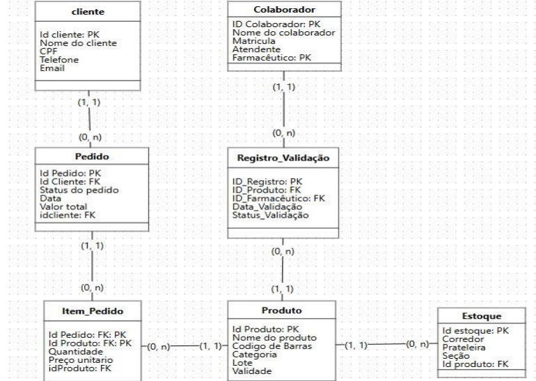

# 🗄️ Artefato 05: Normalização de Banco de Dados (1FN, 2FN e 3FN) - Farmácia

## 📝 Descrição do Projeto
Este projeto documenta o processo de refinamento e normalização do modelo lógico de dados para o sistema do **Canal de Pedidos de Farmácia**. Após a definição inicial do minimundo e do diagrama entidade-relacionamento (DER), a normalização foi aplicada para garantir a qualidade, eficiência e integridade da estrutura do banco de dados, preparando-o para a fase de implementação.

O objetivo desta etapa foi avaliar criticamente cada entidade do sistema, submetendo-as às regras das três primeiras Formas Normais (1FN, 2FN e 3FN) para eliminar redundâncias, evitar anomalias de atualização, inserção e exclusão, e simplificar futuras consultas.

## 👥 Equipe do Projeto
* **Integrantes:** Gabriel Tino, João Paulo, Henry William, Ítalo Santos, Rodrigo Lemos e Marcelo Fagundes.
* **Data da Versão:** 02/10/2025.

## 🚀 Metodologia e Conceitos Aplicados
* **Primeira Forma Normal (1FN):** Verificação de atomicidade dos dados, eliminação de colunas com listas/arrays e garantia de que cada linha seja única e identificável por uma Chave Primária (PK).
* **Segunda Forma Normal (2FN):** Garantia de que todos os atributos não-chave dependam da chave primária em sua totalidade (relevante especialmente para entidades com chaves compostas, como `Item_Pedido`).
* **Terceira Forma Normal (3FN):** Eliminação de dependências transitivas, assegurando que os atributos não-chave dependam exclusivamente da chave primária e de nada mais.

## 📊 Resultados e Entidades Analisadas
A análise de normalização foi aplicada individualmente através de checklists rigorosos para as seguintes tabelas do sistema:
1. **Item_Pedido**
2. **Registro_Validação**
3. **Produto**
4. **Estoque**
5. **Pedido**
6. **Cliente**
7. **Colaborador**

Através dessa verificação sistemática, confirmou-se que todas as tabelas atendem aos requisitos de possuir atributos atômicos, dependência total da chave primária e ausência de dependências transitivas, resultando em uma arquitetura limpa e rastreável.

## 🖼️ Diagrama Entidade-Relacionamento (DER) - Revisado
Com base nas conclusões da normalização, o modelo lógico foi redesenhado. O novo diagrama detalha de forma clara todas as entidades, seus atributos principais, Chaves Primárias (PK), Chaves Estrangeiras (FK) e as cardinalidades dos relacionamentos (ex: relações de `1:N` entre Pedido e Item_Pedido, e Produto e Estoque).

*Figura 1: DER do sistema de farmácia revisado e normalizado até a 3ª Forma Normal.*

## 🔧 Próximos Passos
Com o banco de dados devidamente modelado e normalizado, a estrutura teórica está pronta. O próximo passo lógico é a tradução deste modelo (DER) para scripts de banco de dados físicos utilizando DDL (Data Definition Language) em SQL para a criação das tabelas no SGBD (Sistema de Gerenciamento de Banco de Dados) escolhido.

---
[Voltar ao início](https://github.com/marcelofg7/Portifolio_Marcelo_Fagundes)
