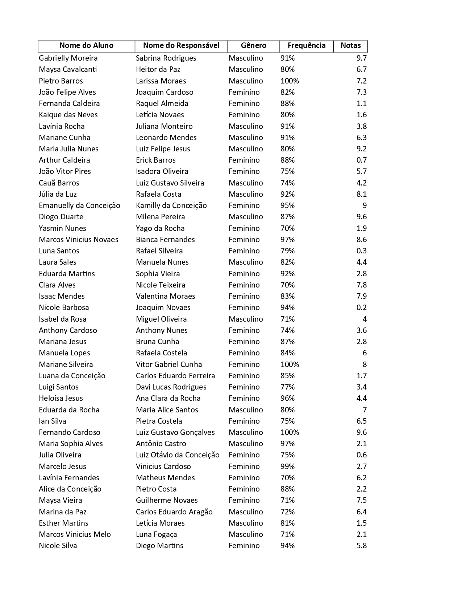
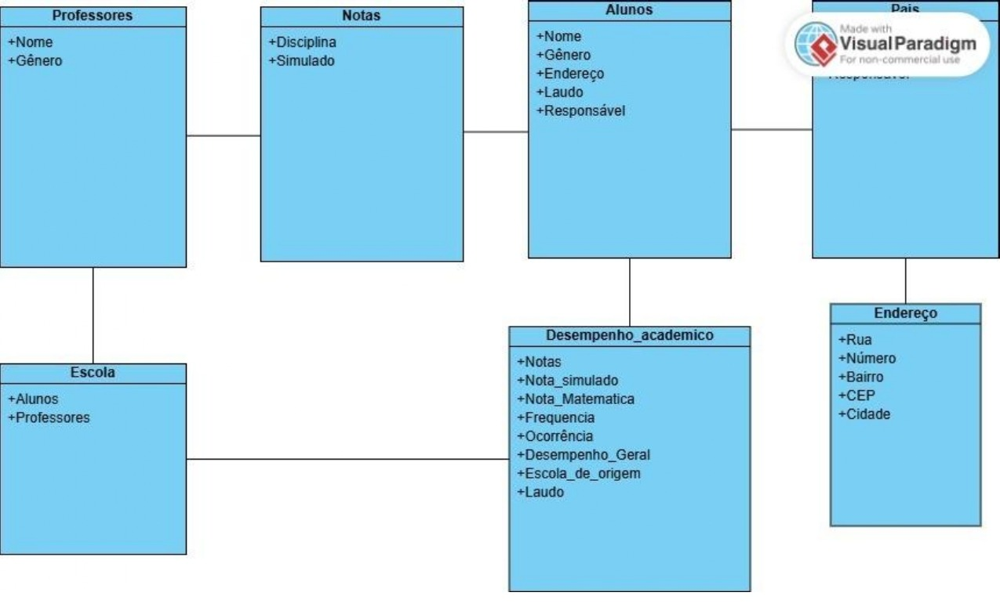

# 🗄️ Modelagem Escolar: Transformação de Dados Brutos em Estrutura Relacional

## 📝 Descrição do Projeto
Este projeto consiste no processo de engenharia de dados aplicado a um cenário acadêmico. O objetivo principal é realizar a transição de uma massa de dados desorganizada — contendo informações de alunos, responsáveis, desempenho acadêmico e endereços — para um modelo lógico estruturado que garanta a integridade e a rastreabilidade das informações.

O trabalho foi dividido em duas fases fundamentais:
1.  **Mapeamento de Dados Brutos:** Coleta e visualização da desordem informacional, onde atributos como "Notas", "Frequência" e "Laudos" estão dispersos sem chaves de ligação.
2.  **Modelagem Relacional:** Organização dos dados em entidades (Alunos, Escola, Endereço, Desempenho) com a definição de atributos específicos e o estabelecimento de relações lógicas (setas de associação) para permitir consultas eficientes.

*Figura 1: Representação visual da massa de dados inicial sem estruturação.*

## 🚀 Tecnologias Utilizadas
* **Modelagem Lógica:** Conceitos de Entidade-Relacionamento (DER).
* **Ferramenta de Design:** Visual Paradigm.
* **Documentação:** Estruturação de Metadados.

## 📊 Resultados e Aprendizados
O experimento permitiu identificar como a organização por "caixas e setas" (entidades e relacionamentos) resolve problemas de redundância e inconsistência.

* **Normalização de Dados:** Aprendi a separar o "Endereço" (Rua, Bairro, CEP) da entidade "Aluno", permitindo que o sistema seja mais modular.
* **Mapeamento de Desempenho:** A criação da entidade `Desempenho_academico` permitiu centralizar métricas distintas (Frequência, Nota de Matemática, Nota do Simulado e Ocorrências) em um único registro vinculado ao Aluno.
* **Identificação de Atributos Críticos:** Foi possível estruturar informações sensíveis, como o "Laudo de Saúde" e "Responsáveis", garantindo que cada dado tenha seu lugar lógico no sistema.
* **Integridade Referencial:** O uso de setas no modelo organizado demonstra como a exclusão ou alteração de uma "Escola" impacta os registros de "Professores" e "Alunos" vinculados.

*Figura 2: Diagrama de Entidade-Relacionamento exibindo a arquitetura final do banco de dados.*

## 🔧 Como Executar
1. Analise o arquivo de dados brutos (Slide 1) para entender a complexidade das informações misturadas.
2. Observe o diagrama relacional (Slide 2) para compreender a hierarquia:
    *   **Alunos** conectam-se a **Endereço** e **Responsável**.
    *   **Desempenho Acadêmico** centraliza todas as métricas de notas e frequência.
    *   **Escola** serve como o nó central que vincula Alunos e Professores.
---
[Voltar ao início](https://github.com/seu-usuario/seu-usuario)
